# 配置 Tunnel、API Key 和 ChatGPT MCP App

## 你需要准备什么

- 已安装 Node.js 20+、npm 和 OpenAI `tunnel-client`。
- OpenAI `tunnel-client` 公开仓库：[github.com/openai/tunnel-client](https://github.com/openai/tunnel-client)（包含客户端源码、发布版本和安装说明）。
- 一个可使用 Secure MCP Tunnel 的 OpenAI Platform 组织。
- 一个有权限创建或使用开发者 MCP App 的 ChatGPT 账号/工作区。
- 创建 Tunnel 所需的 **Tunnels Read + Manage** 权限；运行 Tunnel 和连接时需要 **Tunnels Read + Use** 权限。

## 1. 创建 Tunnel 并复制 Tunnel ID

1. 登录 [OpenAI Platform](https://platform.openai.com/) 并打开 Secure MCP Tunnel 设置。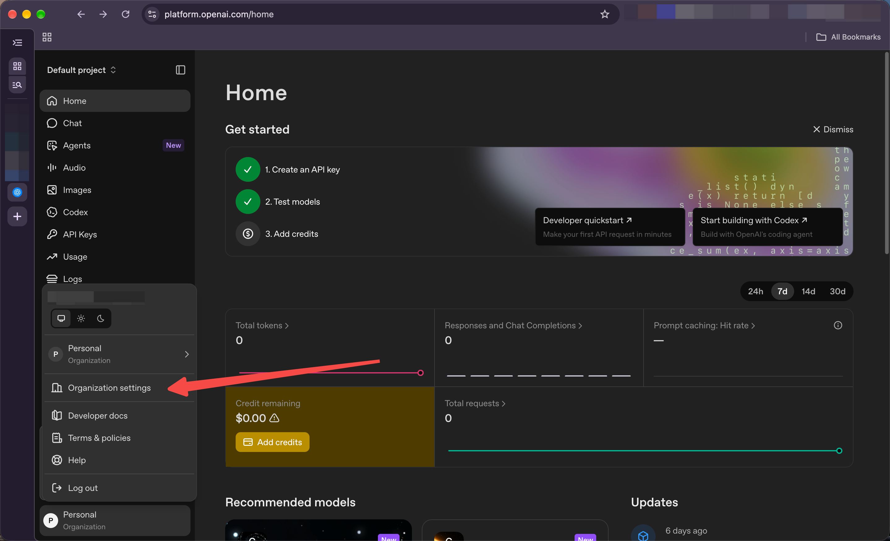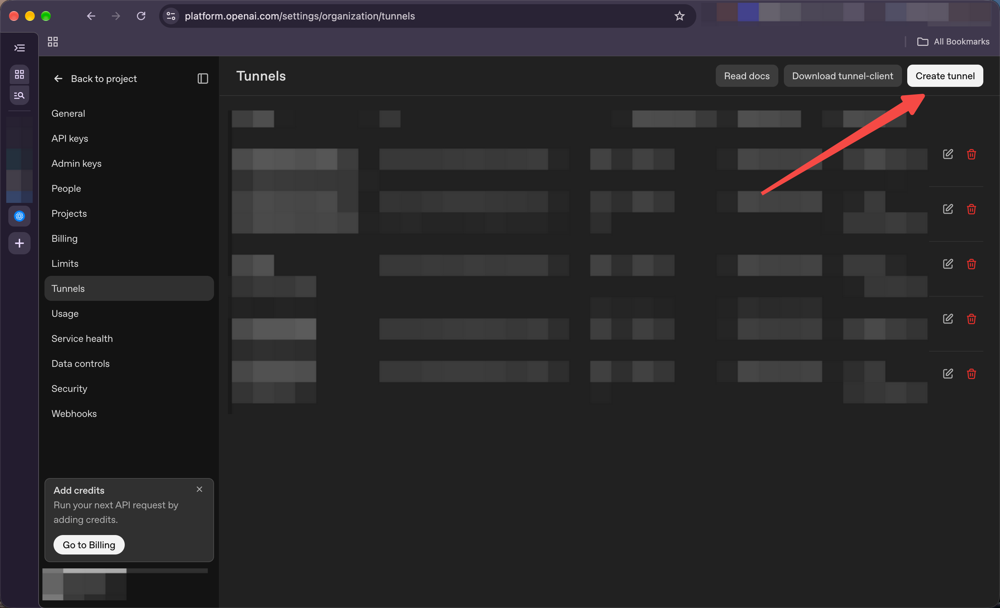
2. 创建一个 Tunnel，名称可以写成 `ChatToCodex-你的电脑名称`，方便以后辨认。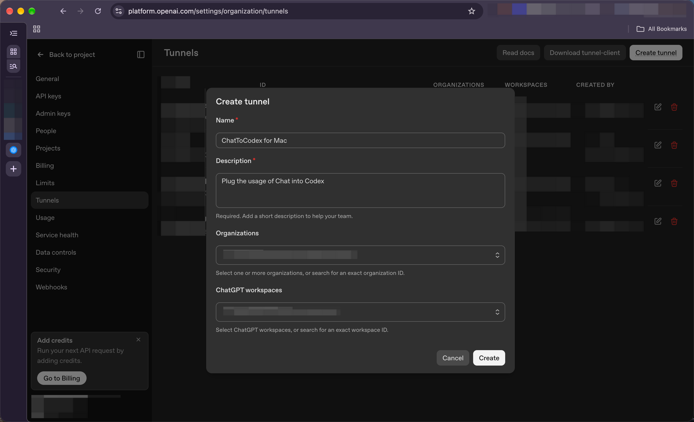
3. 创建完成后复制它的 **Tunnel ID**。它看起来像这样：

   ```text
   tunnel_0123456789abcdef0123456789abcdef
   ```

   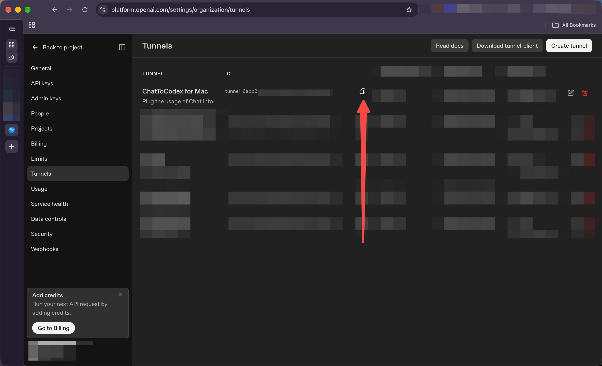

4. 把 Tunnel ID 暂时放在自己安全的位置。它不是 API Key，但仍建议只用于你自己的配置。

## 2. 创建 Restricted runtime API Key

1. 在 OpenAI Platform 的 API Keys 页面创建一个新的 **Restricted** API Key。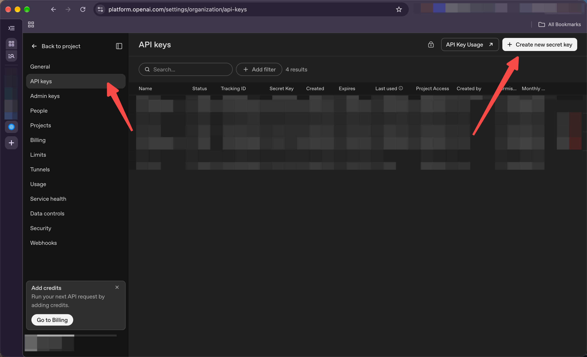
2. 为本机 `tunnel-client` 授予运行 Tunnel 所需权限：**Tunnels Read** 和 **Tunnels Use**。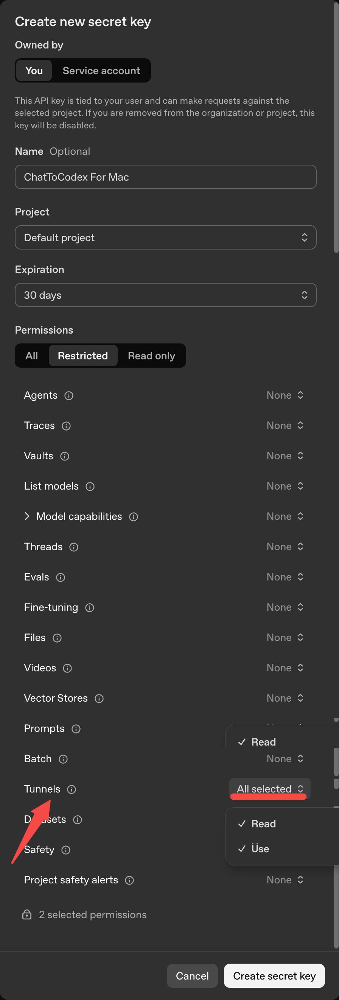
3. 创建后立即复制并妥善保管。完整 Key 通常只会显示一次；如果丢失，请创建新 Key。
4. 这个 Key 是本机 Tunnel runtime 使用的凭据。**不要把它填进 ChatGPT MCP App，也不要提交到 Git、截图或公开聊天中。**

权限名或 Platform 页面若有变化，请以当前 OpenAI Platform 中显示的 Tunnel 权限说明为准；不要为了让连接成功而给 Key 添加无关权限。

## 3. 在本机配置并启动 ChatToCodex

在 ChatToCodex 仓库目录打开 Terminal，运行：

```bash
npm install
npm link
chat-to-codex install
```

安装程序会依次提示：

1. **Tunnel ID**：粘贴刚才复制的 `tunnel_...` 值。
2. **Tunnel API key**：粘贴 Restricted runtime API Key。在交互式终端中输入时字符不会回显；请直接在可信的本机 Terminal 中操作，不要把 Key 写进命令、脚本或共享日志。

ChatToCodex 会把 Tunnel ID 保存在本机配置中，并将 API Key 存入 macOS Keychain 或 Windows Credential/DPAPI 存储。安装过程会设置本机后台 Host；macOS 使用 LaunchAgent。

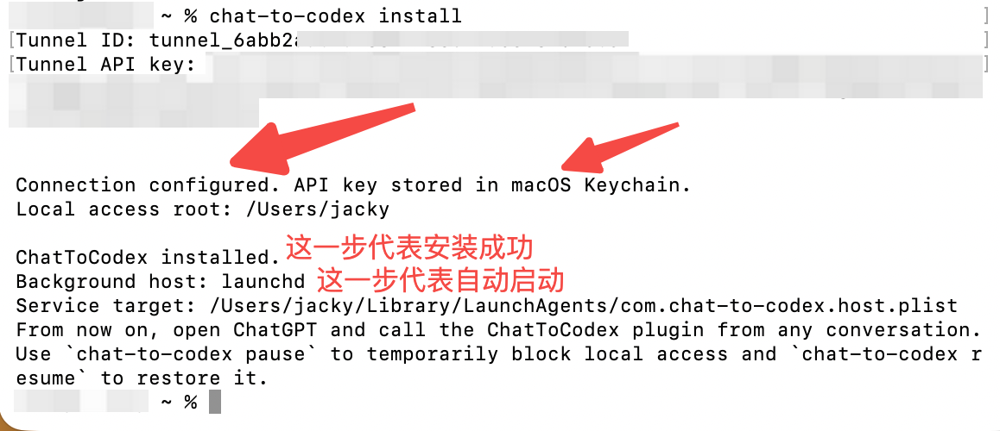

随后检查状态：

```bash
chat-to-codex doctor
chat-to-codex status
```

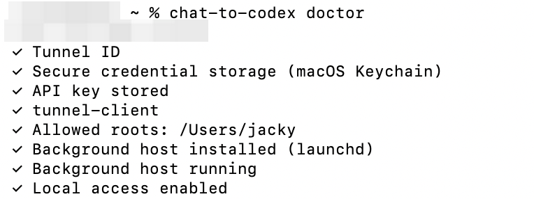继续之前，确认诊断显示 Tunnel ID 有效、API Key 已存储、后台 Host 已安装并运行。创建 MCP App 和扫描工具时，本机 Host 与 `tunnel-client` 必须保持在线。

## 4. 在 ChatGPT 创建 MCP App

使用 ChatGPT 网页版，网址https://chatgpt.com/plugins。

1. 点击右上角 **Add**，选择 **MCP App**。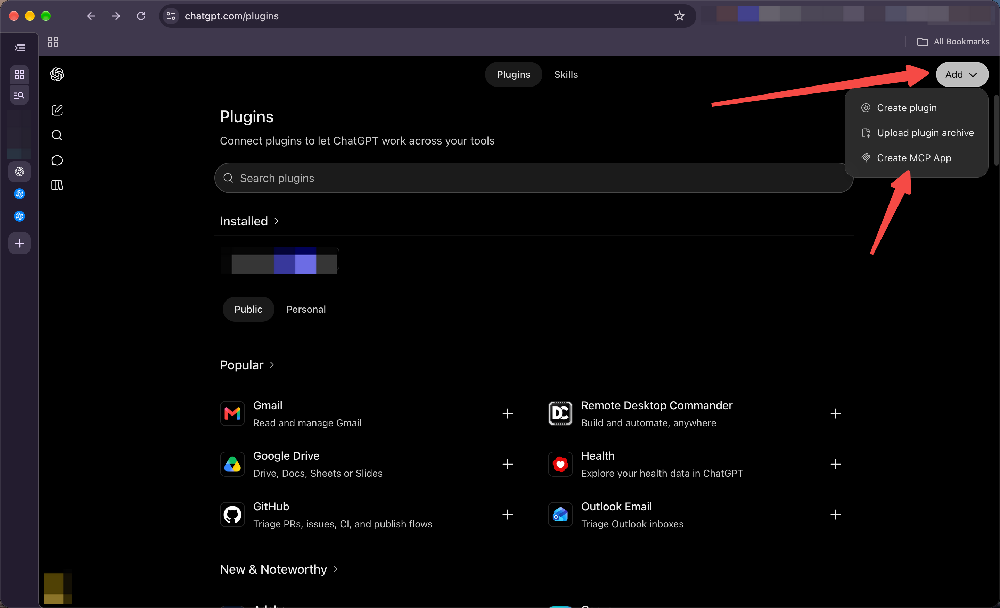
2. 输入名称，例如 `ChatToCodex Core`。
3. 连接方式选择 **Tunnel**。
4. 选择刚创建的 Tunnel，或粘贴本机配置使用的同一个 **Tunnel ID**。
5. 对 ChatToCodex MCP App 选择 **No Auth**（无身份验证）。Tunnel runtime API Key 已由本机 `tunnel-client` 使用，不要放进此处。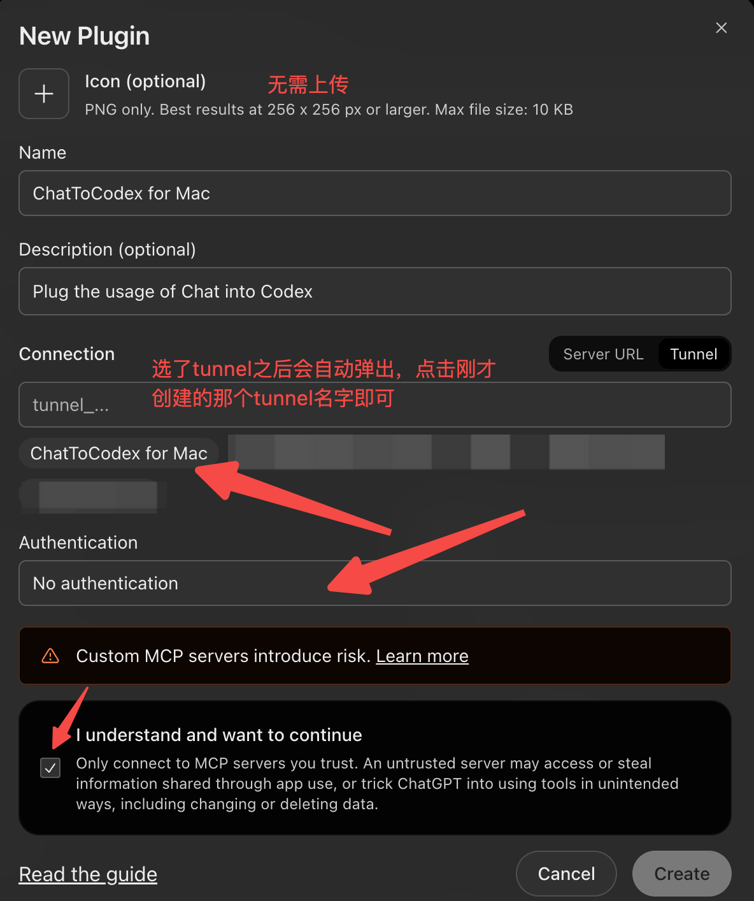
6. 选择 **Scan Tools**。等待扫描完成，检查发现的工具，然后创建 App。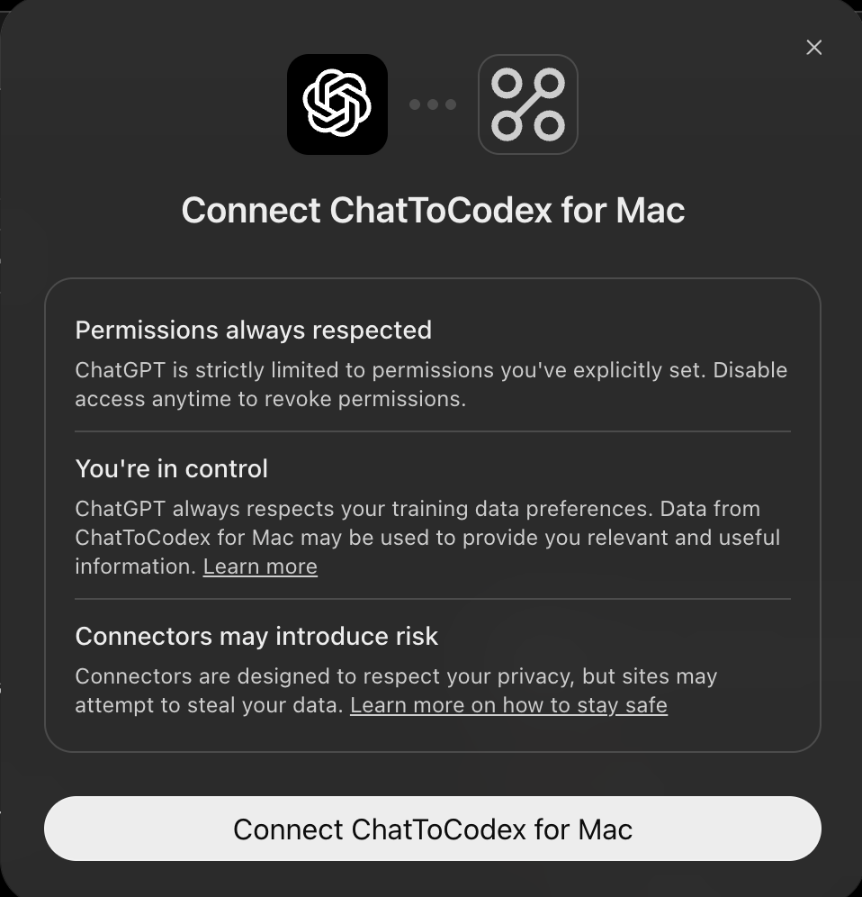

ChatToCodex 会提供本地文件和命令工具，例如 `access_status`、`list_directory`、`read_file`、`write_file` 和 `run_command`。请在启用前检查工作区显示的工具权限。

## 5. 在对话中连接并做安全验证

0. 使用插件之前：无法直接通过chat模式直接改代码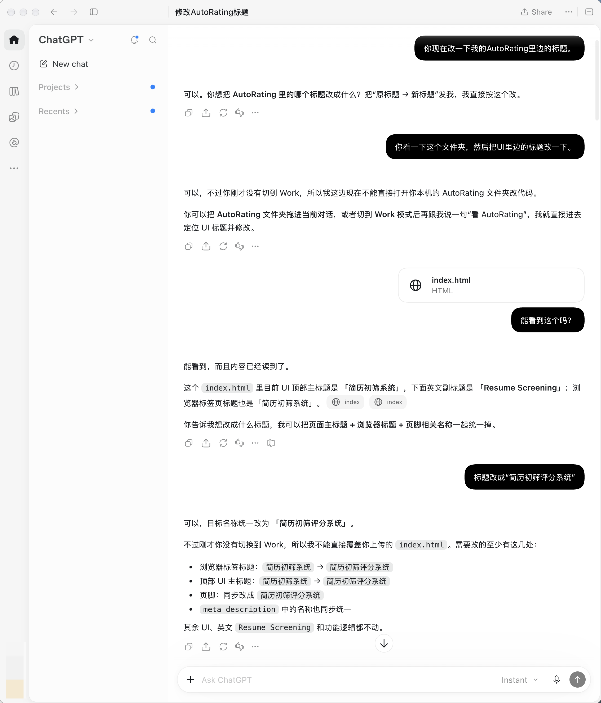

1. 在 ChatGPT 模式下开启一个新对话，选择刚刚创建好的插件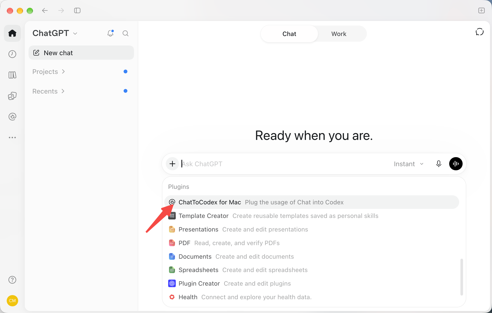
2. 然后就可以直接试着修改了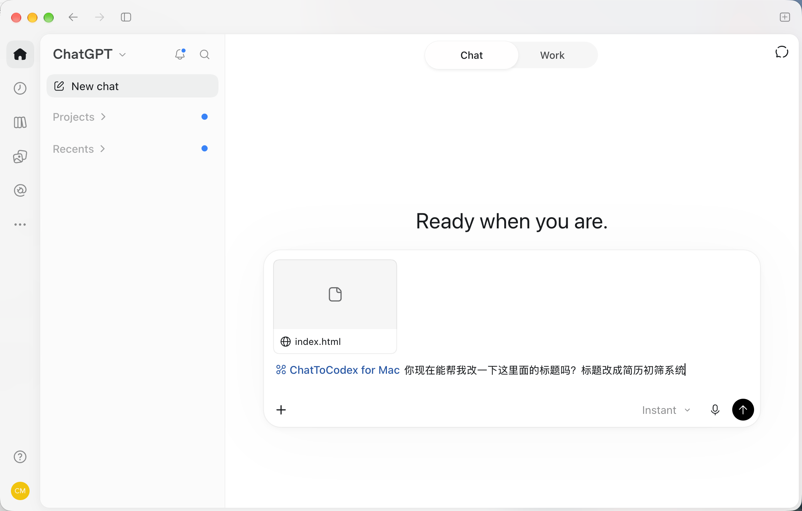
3. 最终执行成功，并且走的是网页版额度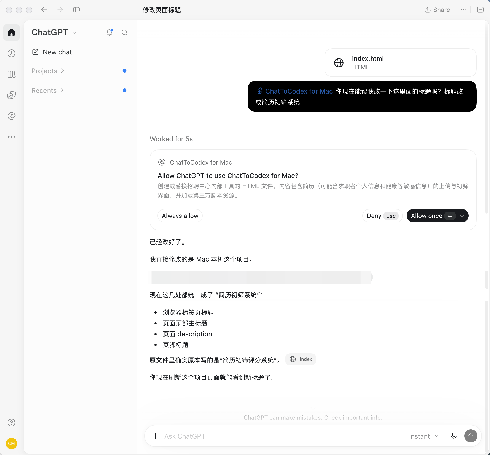
4. 如果你想暂停这个插件，可以运行

```bash
chat-to-codex pause
```

5. 恢复连接：

```bash
chat-to-codex resume
```

目前在每个会话中需要调用这个插件。

## 常见问题

### 安装时提示 Tunnel ID 无效

确认复制的是 Tunnel ID（以 `tunnel_` 开头），不是 Tunnel 名称或 API Key；检查是否完整复制，没有多余空格。

### `doctor` 显示 API key 未存储

重新运行 `chat-to-codex install` 并输入有效的 Restricted runtime API Key。若 Key 已撤销或权限不足，请在 Platform 创建/配置新的 Key。

## 官方参考

- [OpenAI：Developer mode and MCP apps in ChatGPT](https://help.openai.com/en/articles/12584461-developer-mode-and-mcp-apps-in-chatgpt)
- [OpenAI Platform](https://platform.openai.com/)
- [ChatToCodex macOS 安装指南](INSTALL_MAC.md)
